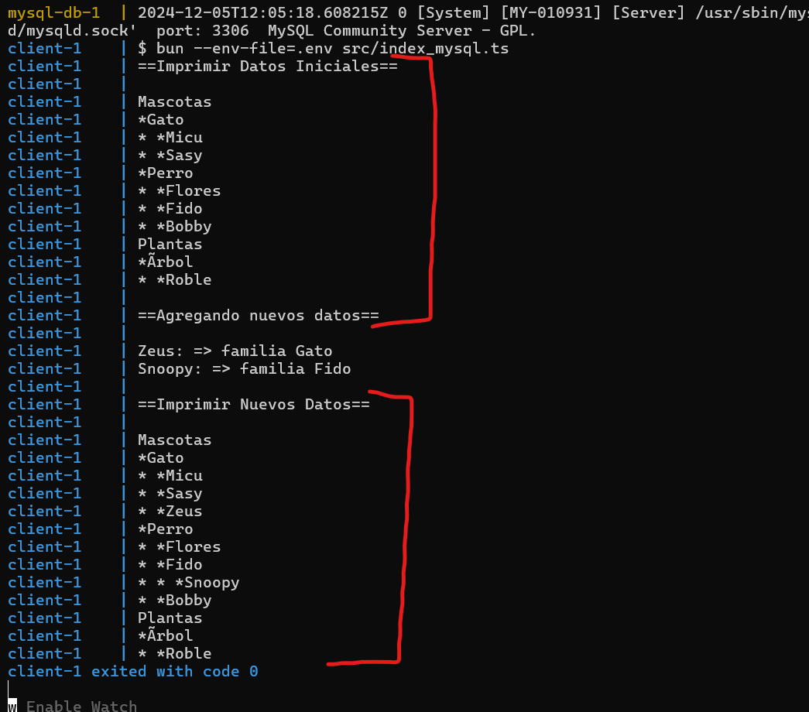
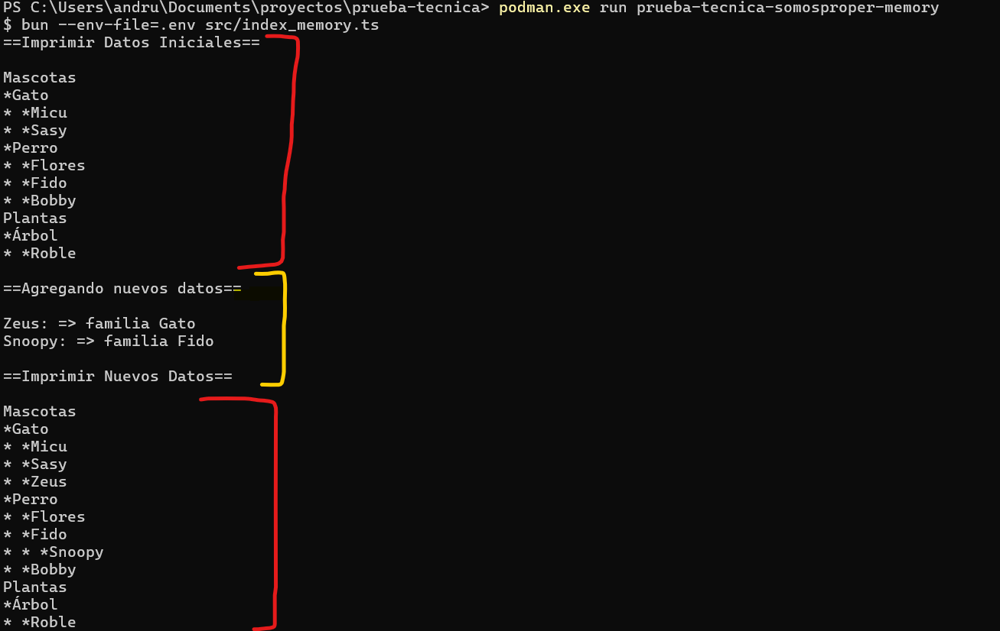

# Prueba tecnica (somosproper)

Este proyecto cuenta con una capa en Memoria y una en MYSQL Para mayor comodidad de la intérpretante.

## Pasos en caso de contar con docker-compose:

### Mysql (Docker Compose)

Compila los servicios

```bash
docker-compose build
```

Levanta el servicio

```bash
docker-compose up
```

<div align="center">
        
</div>

_Nota, este proceso puede demorar un poco hasta que la base de datos este completamente en linea_

## Pasos en caso de contar con Docker:

### Memoria (Docker):

En caso de ejecutar la capa mas sencilla en memoria solo es necesario ejecutar los siguientes comandos:
Para compilar:

```bash
docker build -f ./dockerfiles/Dockerfile.memory -t prueba-tecnica-somosproper-memory .
```

Para ejecutar:

```bash
docker run prueba-tecnica-somosproper-memory
```

<div align="center">
        
</div>

### MYSQL (Docker):

En caso de ejecutar la capa con mysql necesitamos preparar la base de datos.

Creamos una red para conectar la base de datos con el cliente

```bash
docker network create -d bridge somosproper-net
```

Iniciamos la base de datos

```bash
docker run -d -p 3306:3306 -e MYSQL_DATABASE="somosproper" -e MYSQL_USER="somosproper" -e MYSQL_PASSWORD="4f283344-e164-4654-8e7f-f4e6c922134d" -e MYSQL_ROOT_PASSWORD="33062777-4d80-49fb-9d44-1b9de7439404" --name mysql-db --network=somosproper-net -v migrations/init.sql:/docker-entrypoint-initdb.d/1.sql mysql
```

Compilamos el cliente

```bash
docker build -f ./dockerfiles/Dockerfile.mysql -t prueba-tecnica-somosproper-mysql .
```

Y para finalizar ejecutar el cliente.

```bash
docker run  --network=somosproper-net prueba-tecnica-somosproper-mysql
```

_Nota, si se ejecuta este comando antes de que termine de iniciar la base de datos puede generar problemas_
